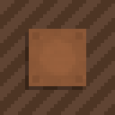

# Leather Blocks 

    

Adds a leather block to the game which can be dyed like leather armor.

  - Leather Blocks **>= 1.2.0** requires Architectury API ([Fabric](https://www.curseforge.com/minecraft/mc-mods/architectury-fabric)/[Forge](https://www.curseforge.com/minecraft/mc-mods/architectury-forge))
  - Leather Blocks **< 1.2.0** requires [Fabric API](https://www.curseforge.com/minecraft/mc-mods/fabric-api)

Leather blocks can be crafted by using 4 iron nuggets, 4 leather, and a wooden plank.

Dye leather blocks exactly as you would dye leather armor.

## Screenshots

## FAQ

#### Can you port this to *\<older Minecraft version>*?

No.

#### Can you update this to *\<newer Minecraft version>*?

Maybe.
